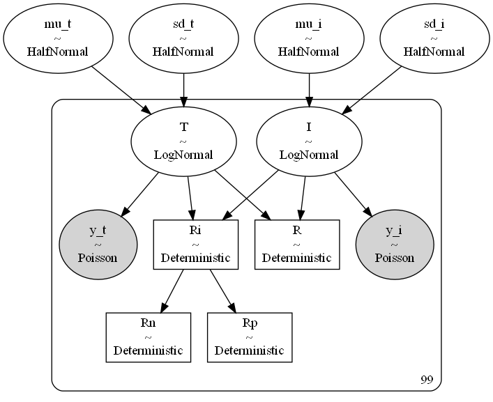
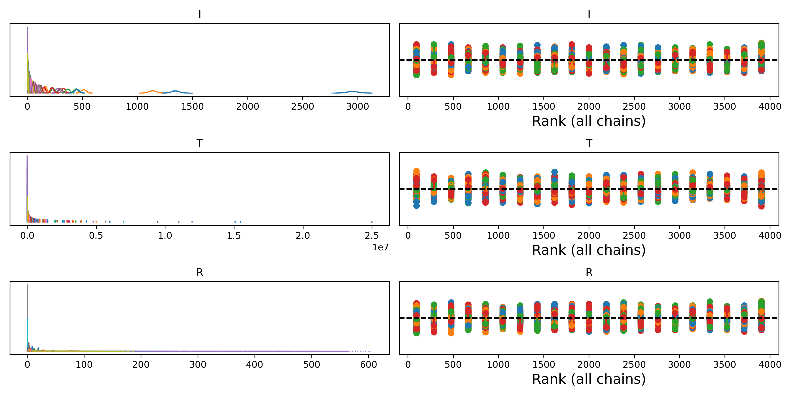
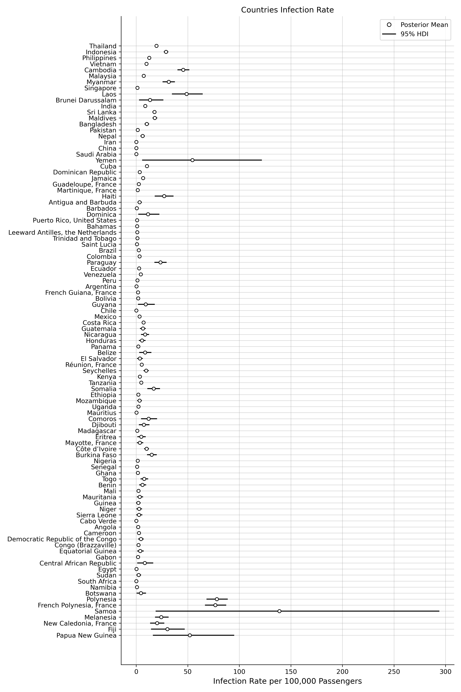
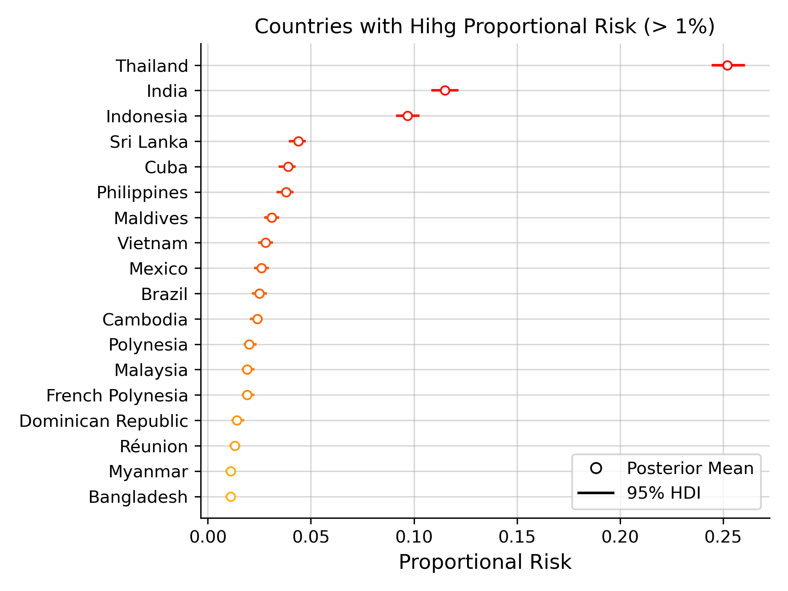

<h1> Overall Risk of Dengue Importations to Europe from 2015 to 2019 Data </h1>

	The present analysis implements a simple Bayesian Poisson model to estimate uncertainty on deterministic risk measures. Here, risk is understood as the proportional contribution of infected travellers. Data used is from Table 1 reported in the study by Gossner and colleagues (2022), due to data restrictions no more data was available. We removed countries without precisely reported number of cases of ratio of infected passengers (e.g. reported as > 100) for analysis. This resulted in 99 countries with reported travellers towards Europe, providing pooled (i.e. total counts) data from between 2015 and 2019. We included risk measures inspired by approaches such as Lee et al (2021), so we can account for the higher/lower propensity a country may have of exporting/importing Dengue cases to Europe.

<h1> Model </h1>

 The model simply samples the counts of infected passengers and total passengers from c...99 countries. thus, this is a simple Poisson model estimating uncertainty of infected and total passengers and later taking deterministic measures of ratio of infected passengers and risk. Poisson distributions for infected and total travellers are parametrised with Log-Normal distributions with Half-Normal hyperpriors for their means and standard deviations. This makes the model effectively hierarchical, i.e. it accounts for variation per country. 

 &mu;I ~ HalfNormal(1) 

 &sigma;I ~ HalfNormal(1) 

 &mu;T ~ HalfNormal(1) 

 &sigma;T ~ HalfNormal(1) 

 Ic ~ LogNormal(&mu;I, &sigma;I), Ic=1...Ic=99 

 Tc ~ LogNormal(&mu;T, &sigma;T), Tc=1...Tc=99 

 y&#770;I ~ Poisson(I)

 y&#770;T ~ Poisson(T)

 R = 100000*I / T , ratio of infected passengers

 Ri = (I / (T-I))*T , raw risk 

 Rn = Ri / max(Ri) , normalised risk 

 Rn = Ri / &Sigma;Ri , proportional risk 

_________________________________________________________________________________

	

 We sampled the model using MCMC NUTS with 1000 tuning steps, 1000 samples. Convergence was good with all R&#770; =~ 1, and ESS > 4000 for all parameters and all BFMIs > 0.9. Rank plots indicate excellent chain mixing.

	

<h1> Results </h1>

 Results indicate that ratios of infected passengers are matched precisely to those reported in Gossner et al. (2022), see the summary.csv file for details.

	

 More important to our analysis are proportional risk estimates. Namely, the proportion of risk (from 100%) that can be attributed to one country. This indicates that respect to all other analysed countries a given country has higher or lower risk of importing Dengue to Europe. 

	

 As a checkup, we run a Multinomial model with Dirichlet priors (see multinomial_version folder). Results are equivalent to the Poisson model (as it should be expected). 

<h1> Conclusion </h1>

 Present results indicate that Thailand holds the higher proportion of risk respect to other countries with ~25% of total risk, followed by India with ~12% and Indonesia with ~10%. It is important to emphasise that relevance of a risk measure, as the ratio of infected passengers may not reflect the actual propensity of a country to export Dengue cases to Europe. For instance, Thailand's ratio of infected passengers is relatively low respect to other countries, but poses a much higher risk of exporting Dengue due to the higher number of both total and infected travellers. 

<H1> References </H1>

Gossner CM, Fournet N, Frank C, Fernández-Martínez B, Del Manso M, Gomes Dias J,
de Valk H. Dengue virus infections among European travellers, 2015 to 2019.
Euro Surveill. 2022 Jan;27(2):2001937. doi: 10.2807/1560-7917

Lee H, Kim Y, Kim E, ‍Lee S, Risk Assessment of Importation and Local Transmission
of COVID-19 in South Korea: Statistical Modeling Approach JMIR Public Health
Surveill 2021;7(6):e26784, doi: 10.2196/26784

